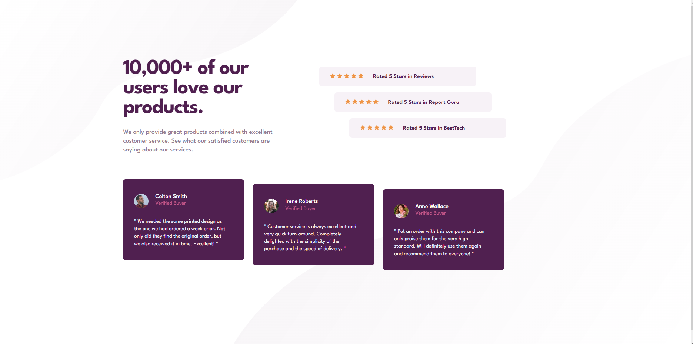
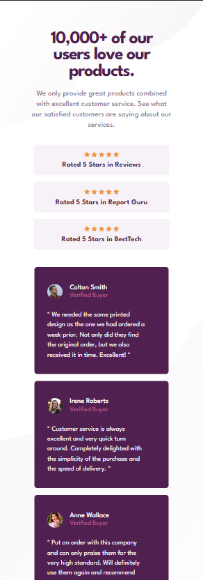

# Frontend Mentor - Social proof section solution

This is a solution to the [Social proof section challenge on Frontend Mentor](https://www.frontendmentor.io/challenges/social-proof-section-6e0qTv_bA). Frontend Mentor challenges help you improve your coding skills by building realistic projects. 

## Table of contents

- [Overview](#overview)
  - [The challenge](#the-challenge)
  - [Screenshot](#screenshot)
  - [Links](#links)
- [My process](#my-process)
  - [Built with](#built-with)
  - [Continued development](#continued-development)
- [Author](#author)

### The challenge

Users should be able to:

- View the optimal layout for the section depending on their device's screen size

### Screenshot

 

### Links

- Solution URL: [https://github.com/NugyTomas/Social-proof-section]
- Live Site URL: [https://nugytomas.github.io/Social-proof-section/]

## My process

### Built with

- Semantic HTML5 markup
- CSS custom properties
- Flexbox
- CSS Grid

### Continued development

This was probably the most complex project I have done so far. I realized I will have to learn easier way to make responsive layout. But I am satisfied with how I managed to do this challenge.

## Author

- Website - [https://github.com/NugyTomas]
- Frontend Mentor - [https://www.frontendmentor.io/profile/NugyTomas](https://www.frontendmentor.io/profile/yourusername)

